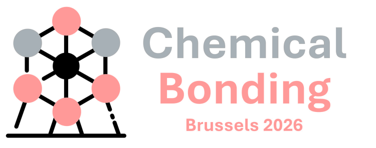
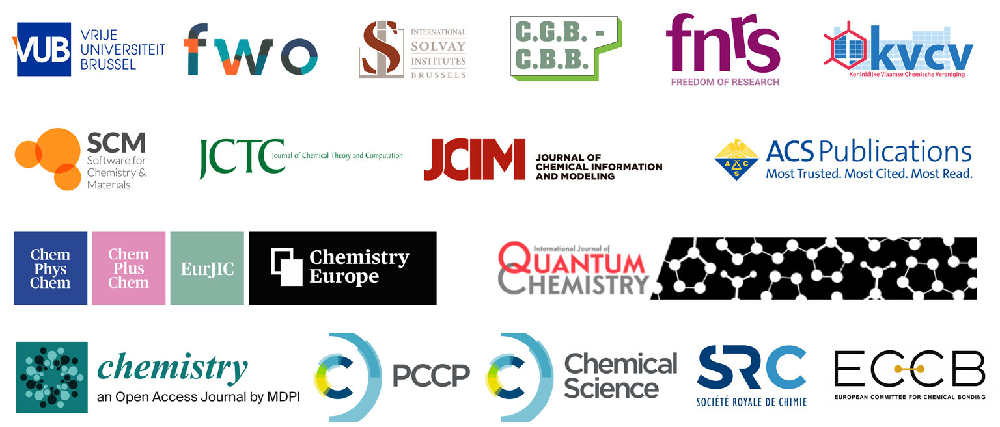

<div align="center">

<picture>
  <source media="(prefers-color-scheme: dark)" srcset="assets/cbond2026-logo-dark.png">
  
</picture>

### 5th European Symposium on Chemical Bonding

[](https://www.eurchembond.com/program/)
[](https://www.eurchembond.com/young-research-symposium/)
[](https://www.eurchembond.com/cbond2026/)

</div>

---

## About this repository

The [conference website](https://www.eurchembond.com/cbond2026/) covers everything else —
programme, speakers, registration. This repo is simply where we keep the heavy files: abstract
books are too big to email around comfortably, so they live here and the website points at them.

Anything here can be linked directly with its raw URL:

```
https://raw.githubusercontent.com/lucienwb/CBOND2026/main/CBOND_Abstract_Book.pdf
```

### Downloads

| File | | |
|---|---|---|
| **CBOND2026 Book of Abstracts** | 145 pp · 31.0 MB | [Download](https://github.com/lucienwb/CBOND2026/raw/main/CBOND_Abstract_Book.pdf) · [Preview](https://github.com/lucienwb/CBOND2026/blob/main/CBOND_Abstract_Book.pdf) |
| **YRS Book of Abstracts** | 37 pp · 4.5 MB | [Download](https://github.com/lucienwb/CBOND2026/raw/main/YRS_Abstract_Book.pdf) · [Preview](https://github.com/lucienwb/CBOND2026/blob/main/YRS_Abstract_Book.pdf) |

---

## CBOND2026

| | |
|---|---|
| **Dates** | Tuesday 8 – Friday 11 September 2026 |
| **Venue** | Palace of the Academies, Rue Ducale 1, 1000 Brussels |

Details: **[eurchembond.com/cbond2026](https://www.eurchembond.com/cbond2026/)**

---

## Young Researchers Symposium

| | |
|---|---|
| **Date** | Monday 7 September 2026, 09:00–17:30 |
| **Venue** | UResidence, VUB Main Campus Etterbeek, Pleinlaan 2, 1050 Elsene |

Details: **[eurchembond.com/young-research-symposium](https://www.eurchembond.com/young-research-symposium/)**

---

## Sponsors & partners

<div align="center">
  
</div>

---

Contact us: **[CBOND26@vub.be](mailto:CBOND26@vub.be)**
